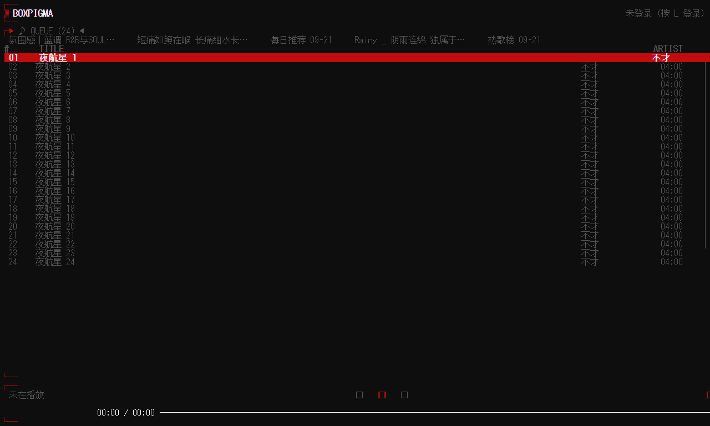

# boxpigma

[](https://github.com/GBLMX/pigma/actions/workflows/ci.yml)
[](https://github.com/GBLMX/pigma/actions/workflows/release.yml)
[](LICENSE)


boxpigma 把网易云音乐与本地音频播放带进终端：流式播放、逐字歌词、歌单与队列管理，全部围绕键盘组织，基于 [Ratatui](https://ratatui.rs)。

**1.0 是这个名字下的第一个版本**：从 `pigma` 改名而来，二进制、配置与缓存目录、IPC 套接字一并改名，旧数据会被自动接管；同时把一批自写实现换成了成熟方案。

<details>
<summary><b>📖 点击展开/折叠目录 (Table of Contents)</b></summary>

- [1.0 有什么](#10-有什么)
- [本仓库与原作者](#本仓库与原作者)
- [Features](#features)
- [Preview](#preview)
- [Install](#install)
  - [一键安装（Linux / macOS）](#一键安装linux--macos)
  - [一键安装（Windows / PowerShell）](#一键安装windows--powershell)
  - [Linux / macOS（手动）](#linux--macos手动)
  - [Windows（手动）](#windows手动)
  - [从源码](#从源码)
- [Usage](#usage)
  - [快捷键](#快捷键)
  - [命令模式（vim 风格）](#命令模式vim-风格)
  - [CLI 控制（status / msg）](#cli-控制status--msg)
  - [无头守护进程模式（boxpigma -d）](#无头守护进程模式boxpigma--d)
- [Configuration](#configuration)
- [排障](#排障)
  - [日志](#日志)
  - [升级后配置/缓存"不见了"](#升级后配置缓存不见了)
  - [界面卡住（不再重绘）](#界面卡住不再重绘)
- [Development](#development)
- [Plan](#plan)
- [License](#license)

</details>

## 版本与迁移

二进制、配置目录、缓存与 IPC 的名字在 1.0 改过一次：

| | |
| --- | --- |
| 二进制 | `boxpigma` |
| 配置 | `~/.config/boxpigma/`（原 `~/.config/pigma/`） |
| 缓存与队列 | `~/.cache/boxpigma/`（原 `~/.cache/pigma/`） |
| IPC | `boxpigma.sock` / Windows 命名管道 `\\.\pipe\boxpigma` |

首次运行会把旧的 `pigma` 目录整体搬过来（配置、cookie、队列、封面缓存都在里面），日志里留一行 `adopted … from before the rename`；搬不动（旧实例还在跑、权限不足）就继续用旧目录，不会静默从空配置开始。

各版本的变更见 [CHANGELOG](./CHANGELOG.md)；框架调整的改前改后、依据与代价（含被否决的候选）见 [FRAMEWORK.md](./FRAMEWORK.md)，性能与内存的实测数字也在那里。

## 本仓库与原作者

| | |
| --- | --- |
| **上游** | [akirco/pigma](https://github.com/akirco/pigma) —— 作者 akirco，Apache-2.0。原始版权与许可声明见 [LICENSE](./LICENSE)，**未作改动** |
| **本仓库** | GBLMX 的 fork，由 GBLMX 维护。这里的提交与 [releases](https://github.com/GBLMX/pigma/releases) 都由本仓库负责，与原作者无关；上游是否采纳这些改动、上游自身的维护计划，本仓库不代表也不承诺 |
| **向上游贡献** | 上游的 [CONTRIBUTING](./CONTRIBUTING.md) 仍然适用。本仓库的 `main` 已与上游分叉，向上游提 PR 请从独立分支（如 `feat/...`）出发，不要从 `main` |

相对上游 `21c380d`（v0.2.14），本仓库自带的改动分两类 —— 这个划分决定了同步方式（见 CONTRIBUTING 的「与上游同步」一节）。

**一、结构性差异**（上游不会覆盖；每次同步必然冲突，冲突时保留本仓库版本）

- **项目身份**：包名与二进制名 `boxpigma`（上游为 `pigma`），配置目录 `~/.config/boxpigma`、缓存目录 `~/.cache/boxpigma`、IPC socket `boxpigma.sock` 与 Windows 命名管道一并改名；首次运行会把旧的 `pigma` 目录整体接管过来（搬不动就继续用旧目录），不丢配置与缓存
- **构建**：独立的 crate 收进一个 Cargo workspace —— 依赖版本统一（rustls 三份规格合一）、`cargo test/clippy --workspace` 覆盖全部成员，CI 增加 ubuntu 与成员检查
- **日志栈**：`tracing` + `tracing-appender`（按天轮转、保留最近 7 个、行内带模块路径与本地时间）；135 处 `log::*!` 由 `tracing-log` 桥接，调用点无需改动
- **UI 内部结构**：页面分发、页面按键与键位表合并为一张表（新增一个页面从改 9 个文件降到 2 个）；铺底色改用 `Fill`
- **主题内部**：WCAG 亮度与对比度改用 `palette`，全仓只剩一处颜色数学；`default_theme = "random"` 每次启动随机挑一个、`:theme random` 立刻重掷；主题名排序固定，`:theme` 循环顺序不再随进程变化
- **启动画面**：字形取自 FIGlet 字体 `Calvin S`，一次渲染后作为常量内嵌（运行时不带字体依赖）
- **配置**：`config_version` 版本号，旧文件加载时自动升级、备份为 `config.toml.bak-v{旧版本}` 并当场重写为新 schema

**二、增量差异**（可被上游采纳或替代；挑上游提交时优先看这一类）

- **修复**：下载缓存条目只在流完成后记录 · 默认日志级别改为 INFO · 清空的 `sections`/`columns` 序列化不再 panic · eapi 非 2xx 只告警 · IPC socket 权限收窄到属主 · `.gitignore` 忽略调试残留 · 搜索、封面、音频流补齐连接与读超时（音频流刻意**不加**总超时，否则会截断正在播放的下载）
- **播放**：解析失败按类型分类（网络失败重试一次、无版权/无地址直接走云盘兜底），不再靠错误字符串前缀判断
- **外观**：符号预设（`nerd`／`unicode`／`ascii`，不装 Nerd Font 也能用）· 按终端能力降级真彩色 · 依据终端背景自动选明/暗主题（Linux/macOS 问终端 OSC 11，Windows 读控制台调色板）· **背景也由主题绘制**（此前只给文字上色，浅色主题在深色终端上会变成零星灰字）· 内置 20 套主题 + `[themes.<名>]` 继承式自定义 · 高亮行的前景色按对比度自动选取，浅色主题下也读得出来
- **新增**：频谱可视化 · 音高读数（自实现 YIN，无新增依赖）· 鼠标交互（点击 seek／切区／播放控制／模式／喜欢／静音）· vim 风格 `:` 命令行与 Tab 补全（密码/短信登录、退出登录、签到）· 听歌打卡（播满约 30 秒即上报，与官方客户端口径一致；短于 30 秒的歌以播完为准）· **面板可拖拽可开关**（框内顶栏/侧栏/播放条/MV 栏：鼠标拖边界改尺寸、双击折叠还原、`Ctrl+方向键` 同义，尺寸与折叠态写回配置；**外框不动**）· **进度条样式预设**（`:progress`，一种样式一个词，逐键仍可覆盖）· **歌词五种显示样式**（`:lyrics window|one_line|ktv|flow|plain`，`ktv` 是单色卡拉OK填充、颜色由 `lyric_ktv_color` 定）· 译文与原文一眼分得开（译文行带标记，`y` ／`:translation` 开关）· 歌词严格按解码位置对轴 · 终端开关：`mouse`／`cursor_style`／`[notify]` 桌面通知 · 随仓库提供的性能基准
- **终端协议**：kitty 图形协议封面（可用 `[playerbar] image_protocol` 强制）· 同步刷新（整帧一次性呈现，也是 kitty 放图的规范要求）· kitty 键盘协议（`Esc` 不再被读成 `Alt+<key>`）· 括号粘贴 · 封面协议以**终端的回答**为准，tmux 内自动回退（Windows 的 ConPTY 不回答该查询，故按环境判定，见 [Windows](#windows)）· kitty 的桌面通知用其自有的 `OSC 99`（标题与正文分开、Base64 负载、`f=` 声明应用名），其余终端保持 `OSC 9` 逐字节不变

**注意：**

> 该项目仅供学习与研究使用。

**升级提示：`config.toml` 现在带 `config_version`。旧文件（缺少该字段的按 v0 处理）在加载时会自动升级：先把原文件备份为 `config.toml.bak-v{旧版本}`，然后当场按新 schema 重写 —— 新版本删掉的键不会再留在你的文件里，而不是等到下一次保存。已经是当前版本的文件一个字节都不动（手写的注释因此保留）；来自更新版本的文件同样按原样使用（未识别的字段忽略，不会被降级覆盖）。**

**[配置参考](./config.example.toml)**

**终端必须配置并使用支持 Nerd Fonts（如 JetBrainsMono Nerd Font, FiraCode Nerd Font 等）的字体，否则 `\uE0B2`等字符无法正确显示，会变成乱码或方块。**

## Features

**播放**

- [x] 流式播放、边听边存、低延迟 seek、本地音频播放
- [x] 下载管理（与边听边存重合）· 云盘上传（缓存文件、本地文件）· 音量控制
- [x] 播放模式、心动模式、歌曲操作（like / dislike / fav …）

**界面**

- [x] 自定义渲染的导航列表与内容列表、表头自定义、数据分页加载
- [x] 歌词五种显示样式（窗口 / 一次一行 / KTV 单色填充 / 颜色流动 / 纯列表）+ 渐变逐字高亮 + 严格按解码位置对轴 + 译文标记与翻译开关
- [x] 重写 playerbar（含封面）· 主题背景完整绘制 · 高亮行对比度自动保证
- [x] MV 海报面板（歌词页随歌自动加载海报与标题 / 歌手 / 时长 · 发布日期 / 简介；无 MV、取不到、或页面放不下就**整块不画**，页面与之前逐字节一致）· 顶栏圆形头像（登录后显示）· 黑胶旋转（`[playerbar] spinning_cover`，默认关闭）
- [x] 设置页（`,` / `:settings`）：外观 / 歌词 / 播放条 / 通知 / 缓存 五组开关收进一张表——左侧分组、右侧条目与当前值。每行改动用的是**该设置自己的 `:` 命令**（鼠标捕获、光标形状、`random` 主题这些副作用照旧生效），行的值直接从 `config.toml` 的该键路径读回，行的选项取自命令自己的补全列表（新增预设无需改页面）
- [x] 频谱可视化（`v`）· 音高读数（`V`，自实现 YIN，无新增依赖）
- [x] vim 风格 `:` 命令行与 Tab 补全 · command panel（`ctrl+p`）· 鼠标交互与光标形状
- [x] 重写 splash

**终端**

- [x] kitty 图形协议封面（可用 `[playerbar] image_protocol` 强制）· 协议以**终端的回答**为准，tmux 内自动回退
- [x] 同步刷新（整帧一次性呈现）· kitty 键盘协议 · 括号粘贴
- [x] 桌面通知（切歌 / 出错；kitty 走 `OSC 99`，其余终端 `OSC 9`）

**集成与打包**

- [x] 命令行控制（`status` / `msg`）+ JSON IPC（waybar 等）· 守护进程模式（`boxpigma -d`）
- [x] 系统包管理器安装（yay / paru / scoop）· shell 补全（bash / zsh / fish / elvish / powershell）

**开发**

- [x] 单一 Cargo workspace（`cargo test/clippy --workspace` 覆盖全部成员）
- [x] 随仓库提供的性能基准（`cargo test --release --lib -- --ignored --nocapture`）

**待办**

- [x] command panel 重写，更多运行时配置支持（`ctrl+p` 面板 + `:mouse` / `:cursor` / `:notify` / `:lyricgradient` / `:saveonplay` 等可运行时修改的设置）
- [x] 云盘源作为 fallback（NCM → **云盘** → 才报错）
- [x] 本地音频歌词、元数据重写（`lofty` 读标签；同名侧车 `.lrc` 复用既有歌词管线）
- [x] 歌手详情页：简介 / 热门曲目 / **专辑 / 相似歌手** —— 三个列表共用一个光标（`Tab`/`Shift+Tab` 循环），专辑可走可开（`Enter` 打开该专辑，`Esc` 回到歌手页），相似歌手 `Enter` 直接跳过去；鼠标点哪栏就选中哪栏，滚轮走指针所在那栏
- [x] 推荐生态接入既有侧栏与内容页：相似歌曲 / 包含该歌的歌单 / 听歌排行（本周 · 全部）/ 推荐电台 / 私人 FM（`:simi` `:simiplaylist` `:fm` `:fmtrash`）
- [x] `[audio]` 播放链（解码之后、设备之前）：`rubato` 采样率转换（采样率与设备一致时样本不做处理）、`biquad` 参量 EQ、`ebur128` 响度归一化、Windows 上 WASAPI **独占**输出（设备拒绝时回退共享模式并说明原因）
- [x] landing page（`docs/index.html`，随 Pages 部署）

## Preview


<table>
  <tr>
    <td></td>
    <td></td>
  </tr>
  <tr>
    <td></td>
    <td></td>
  </tr>
  <tr>
    <td></td>
    <td></td>
  </tr>
</table>

它们是**应用自己画出来的**：`src/ui/shots.rs` 里的 `shots` 会把整页渲染到离屏缓冲（就是测试用的那个 `TestBackend`），再导出 HTML 栅格化——所以 UI 一变就能重新生成，也不会带上任何人的账号信息（顶栏是未登录态）。终端支持图形协议（kitty / iTerm2 / sixel）时播放条才会显示封面。


## Install

> 本节命令都对应本仓库的 [releases](https://github.com/GBLMX/pigma/releases)；通过上游渠道装到的是不含本仓库改动的版本。

### 一键安装（Linux / macOS）

```sh
curl -fsSL https://raw.githubusercontent.com/GBLMX/pigma/main/install.sh | sh
```

脚本自己判定平台：`uname -s`/`uname -m` 映射到发布的目标三元组，musl 会被挡下（只发 `gnu`），下载对应资产、按发布里的 `SHA256SUMS` 校验后装到 `~/.local/bin`。

装成**版本化布局**，升级不动正在跑的那个：

```
~/.local/bin/
├── releases/1.4.0-x86_64-unknown-linux-gnu/boxpigma    每个版本各占一个目录
├── current -> releases/1.4.0-x86_64-unknown-linux-gnu  原子切换，指向当前版本
└── install.lock                                        当前版本、安装时间与版本历史
```

`PATH` 里放的是 `current`。装新版本时先下完、校验通过才切 `current`；切换失败会退回旧链接并报错。默认保留最近 3 个版本（`current` 指向的那个永不删），`--rollback` 切回上一个版本。可覆盖的项：

| 参数 | 环境变量 | 默认 |
| :--- | :--- | :--- |
| `--version <tag\|latest>` | `BOXPIGMA_VERSION` | `latest` |
| `--dir <path>` | `BOXPIGMA_INSTALL_DIR` | `~/.local/bin` |
| `--checksums <url\|file>` | `BOXPIGMA_CHECKSUMS` | 资产旁边的 `SHA256SUMS` |
| `--host <url>` | `BOXPIGMA_GITHUB` | `https://github.com`（镜像/代理用） |
| `--rollback` | — | — （切回上一个版本；配 `--dry-run` 只看计划） |
| `--dry-run` / `--force` | — | — |

先看一眼它打算做什么：`sh install.sh --dry-run`。目标版本已装好时是 no-op（`--force` 重装）；`SHA256SUMS` 拿不到（旧版本发布）会**明说「未校验」**而不是假装校验过。

### 一键安装（Windows / PowerShell）

```powershell
irm https://raw.githubusercontent.com/GBLMX/pigma/main/install.ps1 | iex
```

按 `RuntimeInformation.OSArchitecture` 选 `x86_64-pc-windows-msvc` 或 `aarch64-pc-windows-msvc`（不是 `PROCESSOR_ARCHITECTURE`：后者在 ARM64 上跑 x64 模拟 shell 时会报错平台），校验和逻辑与上面一致，装到 `%LOCALAPPDATA%\Programs\boxpigma`：

```powershell
.\install.ps1 -Dir 'D:\tools\boxpigma' -AddToPath   # -Version / -Checksums / -Mirror / -DryRun / -Force
```

### 升级：`boxpigma update`

装过一次之后就不必再跑脚本：`boxpigma update` 把上面那套流程在进程内重做一遍——下载对应资产、按 `SHA256SUMS` 校验、解压进新的 `releases/<版本>-<目标>`，校验通过才切 `current`，切换失败就退回旧链接。需要 shell、curl、tar 的那部分它自己实现了，所以 Windows 上也不必开 PowerShell。

```sh
boxpigma update                    # 装最新版，保留最近 3 个版本（current 指向的那个永不删）
boxpigma update --check            # 只看当前版本 / 最新版本，不下载、不写盘、不改 current
boxpigma update --dry-run          # 只打印计划：下什么、装到哪、校验哪个文件
boxpigma update --version v1.5.0   # 指定版本（`latest` 之外的都按 tag 下载）
boxpigma update --rollback         # 切回上一个版本（连按两次会在两个版本间来回）
boxpigma update --mirror https://ghproxy.example --dir D:\tools\boxpigma
```

`--mirror` 相当于脚本里的 `--host` / `-Mirror`，`--dir` / `--checksums` / `--force` 与脚本同名参数一致。它只处理 `releases/` 已经存在的目录：**首次安装仍然走上面的脚本**（建目录、写 `PATH`、装 `.cmd` shim 都是脚本的事）。同一个版本已装好时是 no-op，`--force` 重装。

### Linux / macOS（手动）

```sh
# https://github.com/marcosnils/bin
bin install https://github.com/GBLMX/pigma
```

或从 [releases](https://github.com/GBLMX/pigma/releases) 下载 `boxpigma-<target>.tar.gz`（`x86_64` / `aarch64`，macOS 为 `apple-darwin`），解包后把 `boxpigma` 放进 `$PATH`。

> `gnu` 构建依赖系统音频库（如 `alsa-lib`）。

### Windows（手动）

从 [releases](https://github.com/GBLMX/pigma/releases) 下载 `boxpigma-x86_64-pc-windows-msvc.zip`（或 `aarch64` 版），解包后把 `boxpigma.exe` 放进 `%PATH%`。

**Windows Terminal 上的行为**（Windows 没有 `/dev/tty`，ConPTY 夹在程序与终端之间，所以两处探测走的是 Windows 自己的接口）：

| 能力 | 在 Windows Terminal 上 |
| :--- | :--- |
| 鼠标（点击 seek／切区／播放控制／模式／喜欢／静音） | 正常：走控制台输入模式（`ENABLE_MOUSE_INPUT`），这也是回收终端自身文本选择的方式 |
| 括号粘贴、`Esc` 歧义 | `CSI ? 2004 h` 与 `CSI > 1 u` 照常发出；**是否生效由终端决定**，不实现的终端忽略它们（`Esc` 保持原有歧义），启动不受影响 |
| 桌面通知 | 走 `OSC 9`（Windows Terminal 支持该形式） |
| 明/暗主题（`background = auto`） | 读控制台的背景色与调色板（`GetConsoleScreenBufferInfoEx`），跟随当前配色方案 |
| 封面 | 图形查询在 ConPTY 下拿不到回答，因此按环境判定：`WT_SESSION` → sixel（需较新的 WT 且未被禁用）。**单元格像素尺寸因此未知**，若封面大小或位置不对，用 `[playerbar] image_protocol = "halfblocks"` 退回半块，或 `"sixel"` 强制 |

> Windows 与 Linux 的发布产物都按 `target-cpu=x86-64-v3` 构建，即需要 **AVX2**（2013 年后的 CPU）。


### 从源码

```sh
cargo install --git https://github.com/GBLMX/pigma.git
```

或本地构建：

```sh
git clone https://github.com/GBLMX/pigma.git
cd pigma                     # 仓库名仍是 pigma，二进制叫 boxpigma
cargo build --release
# binary at target/release/boxpigma
```

## Usage

### 快捷键

| 快捷键        |                     描述                     |
| :------------ | :------------------------------------------: |
| w             |                 清空播放队列                 |
| s/d           |       添加到喜欢/不感兴趣(仅每日推荐)        |
| ?             |                  快捷键面板                  |
| r             |               手动刷新列表内容               |
| tab/shift+tab |                 切换导航区块                 |
| enter         |                播放/进入列表                 |
| space         |                     暂停                     |
| f             |                   播放队列                   |
| l             |                     歌词                     |
| /             |                  搜索/过滤                   |
| b             |                   样式切换                   |
| left /right   |                   seek 15s                   |
| p /n          |                上一首/下一首                 |
| ctrl+p        |                command panel                 |
| L             |               登录网易云                     |
| c             |  切换表格为cell/row模式(回车进入歌手/专辑)   |
| m             | 切换播放模式（适用于我的歌单或我喜欢的音乐） |
| u             |  上传`本地音乐`或`下载管理`的音频到音乐云盘  |
| g/G           |                列表顶部/底部                 |
| v             |        频谱显示开关（同 `:visualizer on`）     |
| V             |          音高读数开关（同 `:pitch on`）        |
| y             |       歌词翻译开关（同 `:translation on`）     |
| 任意可换       |       键位由命令表派生，`[keys]` 里 `命令名 = "键"` 即重绑；值可写多键序列（`"z z"`、`"ctrl+l"`，`Esc` 放弃半截），`""` 解绑     |
| ,             |       设置页（同 `:settings`）：↑↓ 选择 · ←→ 修改 · 空格 开关     |
| `ctrl+↑/↓/←/→` |  拖面板边界：顶栏/播放条、侧栏尺寸（同鼠标拖拽）  |
| tab / shift+tab（歌手页） | 在热门曲目 / 专辑 / 相似歌手之间切换光标；`Enter` 按当前栏生效（歌曲播放、专辑打开、相似歌手跳转） |
| :             |      命令模式（vim 风格，Tab 补全，见下节）     |

### 命令模式（vim 风格）

按 `:` 打开命令行：`Enter` 执行、`Esc` 取消、`Tab` 补全（命令名、`:theme` 的主题名、`on`/`off`）。
结果与错误都以 toast 回报，跟 vim 一样（例如 `E: 未知命令: foo`）。

| 命令 | 说明 |
|---|---|
| `:q` / `:quit` | 退出 |
| `:help` / `:login` | 快捷键面板 / 登录页 |
| `:save` | 立即写回 `config.toml` |
| `:theme <名字>` | 切换主题（`Tab` 会列出全部主题名） |
| `:volume 75` / `:volume +5` / `:volume -10` | 音量（与 `boxpigma msg volume` 同一套语法） |
| `:seek 90` / `:seek +15` / `:seek -30` / `:seek 50%` | 跳到某秒 / 相对跳转 / 百分比 |
| `:clear` | 清空当前播放队列（与 `boxpigma msg clear` 同一动作） |
| `:visualizer on\|off` | 频谱显示开关（同 `v` 键） |
| `:signin <账号> <密码>` | 邮箱或手机号 + 密码登录（`:login` 仍是二维码页） |
| `:sms <手机号>` | 发送短信验证码 |
| `:smslogin <手机号> <验证码>` | 短信验证码登录 |
| `:logout` | 退出登录（清服务端会话与本地 cookie） |
| `:sign` | 网易云每日签到（云贝） |
| `:layout default\|modern\|minimal` | 播放条布局（`modern` 下频谱只有封面列的 8 格宽，另两种布局是整行） |
| `:pitch on\|off` | 音高读数开关（同 `V` 键） |
| `:spin on\|off` | 播放条封面旋转开关（同 `t` 键；默认关闭，暂停即停在当前角度） |
| `:translation on\|off` | 歌词翻译开关（同 `y` 键；关掉后只剩原文） |
| `:settings` | 设置页：全部开关一张表（同 `,` 键；外观 / 歌词 / 播放条 / 通知 / 缓存） |
| `:progress thick\|segment\|line\|blocks\|plain` | 进度条样式（`Tab` 列出五种；裸调用轮流切换，如 `segment` 是斜线 + 彩虹渐变） |
| `:pane <面板> [on\|off\|toggle]` | 显示/隐藏面板（`topbar` / `navigation` / `playerbar` / `mv`；`Tab` 补全；裸为 toggle） |
| `:lyrics window\|one_line\|ktv\|flow\|plain` | 歌词显示样式（`Tab` 会列出五种与各自说明） |
| `:notify song_change\|errors on\|off` | 切歌提示 / 播放错误提示开关 |
| `:mouse on\|off` | 鼠标捕获开关（影响滚轮与双击；当场写终端转义序列） |
| `:cursor default\|block\|underline\|bar` | 终端光标形状（当场生效） |
| `:lyricgradient <预设>` | 歌词扫光渐变（`Tab` 列出全部预设） |
| `:saveonplay on\|off` | 播放时自动写入「我喜欢的音乐」 |
| `:simi`（`:similar`） | 打开当前播放歌曲的相似歌曲（内容页，`Esc` 回到发起的页面） |
| `:simiplaylist`（`:songlists`） | 打开包含当前歌曲的歌单 |
| `:fm` | 取一页私人 FM 并播放 |
| `:fmtrash`（`:fm-trash`） | 把当前 FM 歌曲从私人 FM 里剔除 |

终端背景为浅色时，`:theme` 配合配置里的 `background = "auto"` 与 `light_theme` 会自动选浅色主题。

### CLI 控制（status / msg）

查询/控制一个**正在运行**的 boxpigma 实例（交互界面或守护进程均可），
通过 `~/.cache/boxpigma/boxpigma.sock` 上的 Unix socket 通信：

```bash
# 生成 shell 补全脚本（bash / zsh / fish / elvish / powershell）
# bash
boxpigma completions bash > ~/.local/share/bash-completion/completions/boxpigma

# zsh
boxpigma completions zsh > "${fpath[1]}/_pigma"

# fish
boxpigma completions fish > ~/.config/fish/completions/boxpigma.fish

# powershell：生成脚本并在 $PROFILE 中自动加载（在 pwsh 里执行）
boxpigma completions powershell | Out-File "$HOME/.config/powershell/boxpigma.ps1" -Encoding utf8
Add-Content $PROFILE '. "$HOME/.config/powershell/boxpigma.ps1"'

```

| 命令 | 说明 |
|---|---|
| `boxpigma status` | 查询状态（默认 plain 文本） |
| `boxpigma status --json` | 以 JSON 输出 |
| `boxpigma status -L` | 列出当前播放队列（`>` 标记当前曲目），`-L --json` 输出原始 `QueueSnapshot` |
| `boxpigma status --template "{name}  {artist}  {current}/{duration}  {status}  vol {volume}%"` | 自定义 plain 输出模板 |
| `boxpigma msg list` | 列出当前播放队列（`▶` 标记当前曲目），`--json` 输出原始 `QueueSnapshot` |
| `boxpigma msg next` / `boxpigma msg previous` | 下一首 / 上一首 |
| `boxpigma msg pause` / `boxpigma msg play` | 暂停 / 播放（`boxpigma msg play <song-id>` 按 id 跳播队列中的歌曲） |
| `boxpigma msg search <keyword>` | 搜索并返回歌曲数据（解析顺序：NCM 失败重试一次 → 云盘兜底，标出 `source` 和 `id`），再 `boxpigma msg play <id>` 播放选中的那首 |
| `boxpigma msg toggle_play` | 播放/暂停切换 |
| `boxpigma msg mode` | 切换播放模式 |
| `boxpigma msg like` / `boxpigma msg dislike` | 喜欢 / 不喜欢 |
| `boxpigma msg toggle_like` | 喜欢/取消喜欢（切换当前曲目） |
| `boxpigma msg switch-list <endpoint>` | 动态切换守护进程的队列到指定端点（如 `recommend_songs`、`toplist`），歌单端点可用 `--playlist N` 选第 N 个 |
| `boxpigma msg volume 75` | 绝对音量（0-100） |
| `boxpigma msg volume +5` / `-10` | 相对 ±%（与 TUI 的 `+` / `-` 一致，支持负数） |
| `boxpigma msg seek +15` | 向后跳 15 秒（`-30` 向前；与 TUI 的 `:seek` 同一套语法与校验） |
| `boxpigma msg seek 50%` | 跳到播放进度的一半（也可以直接给秒数：`boxpigma msg seek 90`） |
| `boxpigma msg clear` | 清空当前播放队列（等价于 TUI 的 `:clear`） |
| `boxpigma msg capabilities` | 打印这份 IPC 契约：接口版本、程序版本、动作清单（含别名与是否吃参数）；`--json` 供脚本解析，细节见 [SKILLS](./SKILLS.md) |

`boxpigma status` 的 `--template` 支持占位符：`{name}` `{artist}` `{album}` `{current}`/`{position}`
`{duration}` `{volume}` `{status}` `{mode}` `{id}` `{liked}`。
未指定时默认模板来自配置项 `cli_status_template`；`--json` 优先于配置项
`cli_status_format`（见 [config.example.toml](./config.example.toml)）。

#### 直接走 Unix socket（socat / 脚本）


> **仅 Linux/macOS**：`status` / `msg` 子命令底层就是往 `~/.cache/boxpigma/boxpigma.sock`
> 发一行 JSON。Windows 用的是命名管道，见下节。
> 不想用 `boxpigma` 二进制时，可用 `socat` 或任何 Unix socket 客户端直接控制：

```bash
# 查询状态（返回一行 JSON）
printf '{"cmd":"status"}\n' | socat - "$HOME/.cache/boxpigma/boxpigma.sock"

# 列出播放队列
printf '{"cmd":"list"}\n' | socat - "$HOME/.cache/boxpigma/boxpigma.sock"

# 播放控制（注意 action 是嵌套对象，与 boxpigma msg 实际发送的 JSON 一致）
printf '{"cmd":"msg","action":{"action":"next"}}\n'          | socat - "$HOME/.cache/boxpigma/boxpigma.sock"
printf '{"cmd":"msg","action":{"action":"previous"}}\n'      | socat - "$HOME/.cache/boxpigma/boxpigma.sock"
printf '{"cmd":"msg","action":{"action":"pause"}}\n'         | socat - "$HOME/.cache/boxpigma/boxpigma.sock"
printf '{"cmd":"msg","action":{"action":"play"}}\n'          | socat - "$HOME/.cache/boxpigma/boxpigma.sock"
printf '{"cmd":"msg","action":{"action":"mode"}}\n'          | socat - "$HOME/.cache/boxpigma/boxpigma.sock"
printf '{"cmd":"msg","action":{"action":"like"}}\n'          | socat - "$HOME/.cache/boxpigma/boxpigma.sock"
printf '{"cmd":"msg","action":{"action":"dislike"}}\n'       | socat - "$HOME/.cache/boxpigma/boxpigma.sock"
printf '{"cmd":"msg","action":{"action":"toggle_like"}}\n'   | socat - "$HOME/.cache/boxpigma/boxpigma.sock"

# 音量：绝对（0.0-1.0）或相对增量
printf '{"cmd":"msg","action":{"action":"volume","absolute":0.75}}\n' | socat - "$HOME/.cache/boxpigma/boxpigma.sock"
printf '{"cmd":"msg","action":{"action":"volume","delta":0.05}}\n'    | socat - "$HOME/.cache/boxpigma/boxpigma.sock"

# 切换队列到指定端点（歌单端点可用 "playlist" 选第 N 个，1 起始）
printf '{"cmd":"msg","action":{"action":"switch_list","endpoint":"toplist","playlist":2}}\n' | socat - "$HOME/.cache/boxpigma/boxpigma.sock"
```

约定：每行请求须以换行结尾，服务端每连接处理一个请求并回一行 JSON
（`msg` 成功回 `{"ok":true}`）。socket 路径可用 `--socket <path>` 自定义。

#### Windows：命名管道控制（PowerShell）

Windows 上 IPC 走命名管道 `\\.\pipe\boxpigma`（可用 `--socket <pipe-name>` 自定义），
协议相同（一行 JSON + 换行，服务端回一行 JSON）。用 PowerShell 控制：

```powershell
function Send-boxpigma($json) {
    $pipe = New-Object System.IO.Pipes.NamedPipeClientStream('.', 'boxpigma', [System.IO.Pipes.PipeDirection]::InOut)
    $pipe.Connect(5000)
    $sw = New-Object System.IO.StreamWriter($pipe)
    $sw.NewLine = "`n"
    $sw.WriteLine($json); $sw.Flush()
    $sr = New-Object System.IO.StreamReader($pipe)
    return $sr.ReadLine()
}

Send-boxpigma '{"cmd":"status"}'                 # 查询状态
Send-boxpigma '{"cmd":"list"}'                   # 列出播放队列
Send-boxpigma '{"cmd":"msg","action":{"action":"next"}}'    # 下一首
Send-boxpigma '{"cmd":"msg","action":{"action":"volume","absolute":0.75}}'  # 音量 75%
```

### 无头守护进程模式（boxpigma -d）

以无终端方式后台运行（可挂在 waybar / systemd 下），加载指定的 API 作为初始队列（**不自动播放**，用 `boxpigma msg play` 或 waybar 的 toggle 按钮开始）。

| 选项 | 说明 |
|---|---|
| `boxpigma -d` | 等价于 `boxpigma -d liked` |
| `boxpigma -d toplist` | 加载指定端点 |
| `boxpigma --daemon user_cloud_disk` | `-d` 的全写形式 |
| `boxpigma -d toplist:3` | 歌单/榜单端点用 `:N` 选第 N 个（1 起始） |

支持的内置 API 与导航项一致：

| 端点 | 类型 | 说明 |
|---|---|---|
| `liked` | 歌曲（默认） | 我喜欢的音乐，需登录 |
| `recommend_songs` | 歌曲 | 每日推荐歌曲 |
| `user_cloud_disk` | 歌曲 | 我的云盘 |
| `download` | 歌曲 | 本地下载 |
| `local_music` | 歌曲 | 本地音乐 |
| `recent` | 歌曲 | 最近播放 |
| `recommend_resource` | 歌单 | 每日推荐歌单 |
| `toplist` | 歌单 | 排行榜 |
| `top_song_list` | 歌单 | 热门歌单 |
| `user_radio_sublist` | 歌单 | 我的电台 |
| `user_song_list` | 歌单 | 用户歌单 |
| `user_created_song_list` | 歌单 | 创建的歌单 |
| `user_subscribed_song_list` | 歌单 | 订阅的歌单 |
| `album_sublist` | 歌单 | 收藏的专辑 |
| `search` | 其他 | 搜索热榜（无可播队列） |
| `top_singers` | 其他 | 热门歌手（无可播队列） |

歌单类端点解析出来是一组歌单，默认加载第一个；`-d` 可用 `ENDPOINT:N`（如 `boxpigma -d toplist:3`）选择第 N 个（1 起始），`msg switch-list` 可用 `--playlist N`。序号与 TUI 中列表显示的顺序一致，可先在 TUI 里查看：

启动后即用 `boxpigma status` / `boxpigma msg` 控制；`SIGINT`/`SIGTERM` 会保存会话并干净退出。

**Waybar 集成**：

  - 参考[waybar](./waybar)。状态模块用 bash 脚本 `waybar/boxpigma`，每秒调 `boxpigma status --json` 获取状态并格式化为 waybar JSON。脚本内置 `ensure_daemon`，首次调用时自动启动 daemon。

```jsonc
// ~/.config/waybar/config.jsonc 核心片段
"custom/boxpigma": {
  "exec": "~/.config/waybar/scripts/boxpigma",
  "interval": 1,
  "return-type": "json",
  "on-click-right": "boxpigma msg mode",
  "on-scroll-up": "boxpigma msg volume +5",
  "on-scroll-down": "boxpigma msg volume -5"
}
```

**systemd 用户单元**：

  - 参考 [`systemd/boxpigma.service`](./systemd/boxpigma.service)。`SIGTERM` 走守护进程自己的保存逻辑（队列与播放位置落盘后干净退出），所以 `systemctl --user stop` / 注销登录都不会丢进度。

```bash
mkdir -p ~/.config/systemd/user
cp systemd/boxpigma.service ~/.config/systemd/user/
systemctl --user daemon-reload
systemctl --user enable --now boxpigma
journalctl --user -u boxpigma -f     # 日志
```

  单元默认 `ExecStart=%h/.local/bin/current/boxpigma -d liked`，对应安装脚本的布局；包管理器装的是 `/usr/bin/boxpigma`，`cargo install` 装的是 `%h/.cargo/bin/boxpigma`，改 `ExecStart` 那一行即可（`-d <端点>` 也可以一起改，见上表）。想让它在你**未登录**时也常驻：`loginctl enable-linger "$USER"`。

## Configuration

配置文件在 `~/.config/boxpigma/config.toml`。**带注释的权威参考是随仓库发布的 [`config.example.toml`](./config.example.toml)**，本节只列最常用的几项。

| 项 | 作用 |
| --- | --- |
| `config_version` | 配置版本；旧文件加载时自动升级（先备份为 `config.toml.bak-v{旧版本}`，再当场重写为新 schema）；已经是当前版本的文件不会被重写 |
| `default_theme` / `light_theme` | 暗色/浅色槽位的主题名；可写 `"random"` 每次启动随机挑一个 |
| `background` | `auto`（跟随终端背景）/ 强制 `dark` 或 `light` |
| `[panes]` | 面板尺寸与折叠（`topbar` / `navigation` / `playerbar` / `mv` 的格数，`collapsed` 列出折叠掉的面板；鼠标拖框内边界改尺寸、双击折叠/还原） |
| `paint_background` | 是否用主题背景盖住整帧：`auto`（默认，只在主题背景与终端背景不一致时才盖 —— 一致时盖了也看不见，却会把终端的半透明/亚克力遮住）/ `always` / `never` |
| `[logger] log_level` | `error` / `warn` / `info` / `debug` / `trace` |
| `[themes.<名字>]` | 继承式自定义主题：写 `base` + 要覆盖的颜色 |
| `[[sections]]` / `[[columns]]` | 导航区与内容列表的字段、宽度与覆盖规则 |
| `[playerbar]` | 布局（`default` / `modern` / `minimal`）、进度条样式与渐变（`progress_style` 一句话选样式，`filled_symbol` / `unfilled_symbol` / `gradient_preset` 覆盖它；`gradient_preset` 不设置=跟样式、`""`=强制关闭）、封面与 `image_protocol`、`spinning_cover`（播放时封面缓慢旋转：20 秒一圈、每圈 72 个角度，约 3.6 次/秒重编码；默认关闭，暂停即停在当前角度） |
| `lyric_style` / `lyric_gradient` | 歌词显示样式（`window` / `one_line` / `ktv` / `flow` / `plain`）与扫光渐变 |
| `lyric_ktv_color` | `ktv` 样式的填充色：主题字段（`accent` / `text` …）或颜色本身（`blue` / `#4da6ff` / ANSI 序号） |
| `lyric_translation` | 原文下面是否画译文（同 `y` ／`:translation on\|off`） |
| `[symbols]` | 字形预设（`nerd`/`unicode`/`ascii`）与逐键覆盖：`nav_capsule_*`、`volume_*`、`queue_clear`、`translation`、`visualizer_bars`、`spinner_*`，以及标题/标记类 `title_open`/`title_close`（弹层与歌手页标题的箭头 `► … ◄`）、`submenu`/`selected`（命令面板）、`notice_info`/`notice_warn`/`notice_error`、`task_running`/`task_done`/`task_failed` |
| 主题 schema | 同目录的 `theme.schema.json` 描述主题文件可写的每个键（编辑器用它做校验）；测试保证它不落后于代码 |
| 主题 `[themes.*]` | 基础色之外可按**组件**细化：`[table]`（`header`/`row`/`selected`/`secondary`/`playing`）、`[tabs]`（`active`/`inactive`）、`[lyrics]`（`line`/`sung`/`translation`）、`[popup]`（`border`/`title`/`footer`）、`[notify]`（`info`/`warn`/`error`）；每一项是样式 `{ fg, bg, bold, italic, underline, reversed, dim }`，`fg`/`bg` 可写主题字段名或颜色，未写部分沿用该组件的默认样式 |
| `[keys]` | 键位重绑：`命令名 = "键序列"`（单键或空格分隔的多键，可带 `ctrl+`/`alt+`），`""` 为解绑；不写＝用命令表自带的键 |
| `[terminal]` | 鼠标捕获与光标形状 |
| `[notify]` | 桌面通知开关（切歌 / 出错） |
| `[cache]` | 内容缓存与 save-on-play |
| `[audio]` | 播放链：`resample`（用 `rubato` 转换采样率，采样率一致时不动样本）、`[[audio.eq]]`（每段 `freq`/`gain_db`/`q`，参量峰值滤波）、`[audio.loudness]`（`target_lufs`/`max_gain_db`，EBU R128 响度归一化）、`exclusive`（Windows：WASAPI 独占输出，失败自动回退共享模式并说明原因） |

改完可用 `:save` 立即写回；`:` 命令行里 `:theme <Tab>`、`:layout <Tab>` 都能补全可用取值。

## 排障

### 日志

按天一个文件、保留最近 7 个；开发构建写在工作目录，安装后写在配置目录：

```sh
tail -f ~/.config/boxpigma/debug.log.$(date -u +%Y-%m-%d)
```

行内带模块路径与本地时间：

```
2026-09-21T02:05:15+08:00  INFO boxpigma::ipc: ipc: listening on /home/user/.cache/boxpigma/boxpigma.sock
```

### 升级后配置/缓存"不见了"

不会。首次运行会把旧的 `pigma` 目录整体搬到 `boxpigma` 名下；若日志出现 `could not move …; staying on the old directory`，说明当时搬不动（旧实例在跑或权限不足），程序会**继续使用旧目录** —— 关掉旧实例后再启动一次即可完成搬迁。

### 界面卡住（不再重绘）

从外部抓线程栈即可，不必给程序加代码：

```sh
eu-stack -p <pid>                              # elfutils
gdb -p <pid> -batch -ex 'thread apply all bt'
cat /proc/<pid>/task/*/wchan                   # 内核视角
```

## Development

```sh
git clone https://github.com/GBLMX/pigma.git
cd pigma
cargo run                                             # 交互界面
cargo test --locked --workspace --all-features
cargo clippy --locked --workspace --all-targets -- -D warnings   # 警告即失败（CI 同）
cargo test --release --lib -- --ignored --nocapture   # 性能基准
cargo +nightly fmt
```

贡献流程见 [CONTRIBUTING](./CONTRIBUTING.md)：其中「与上游同步」一节说明本仓库如何按提交 cherry-pick 同步上游，以及哪些文件属于本仓库的结构性差异。

## Plan

- [x] waybar 集成：`waybar/` 下的状态模块脚本与 `config.jsonc` / `style.css` 片段，README 有成段说明
- [x] systemd：给守护进程补一个 unit 示例（`systemctl --user`）
- [x] 守护进程的端点展开（`-d <endpoint[:N]>`，如 `toplist:3`）
- [x] `boxpigma msg` 更多动作（seek、queue 操作等）

## License

Licensed under the [Apache-2.0](LICENSE) license.
