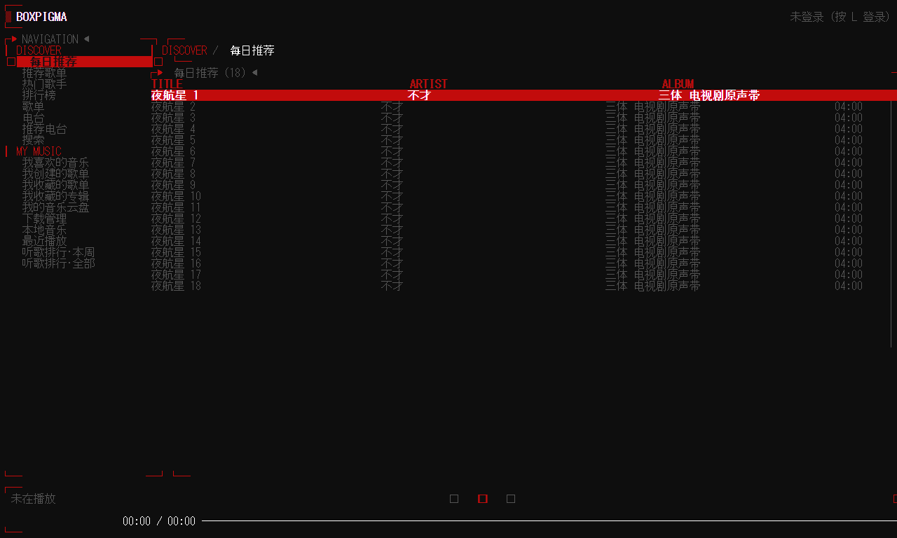
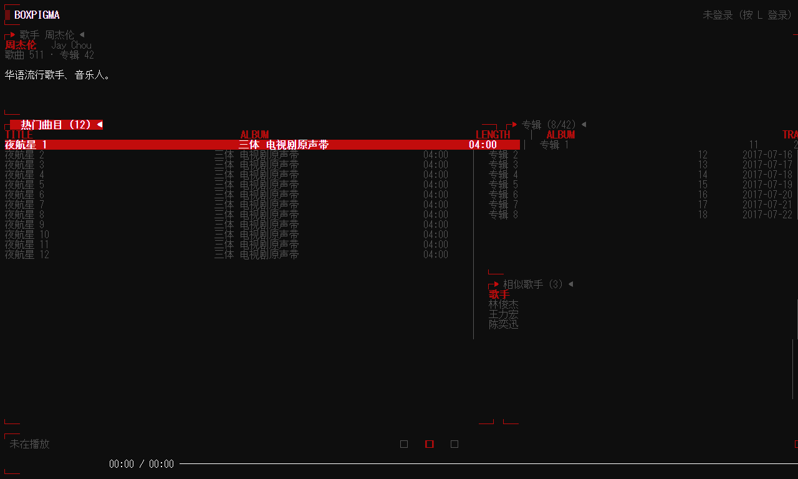
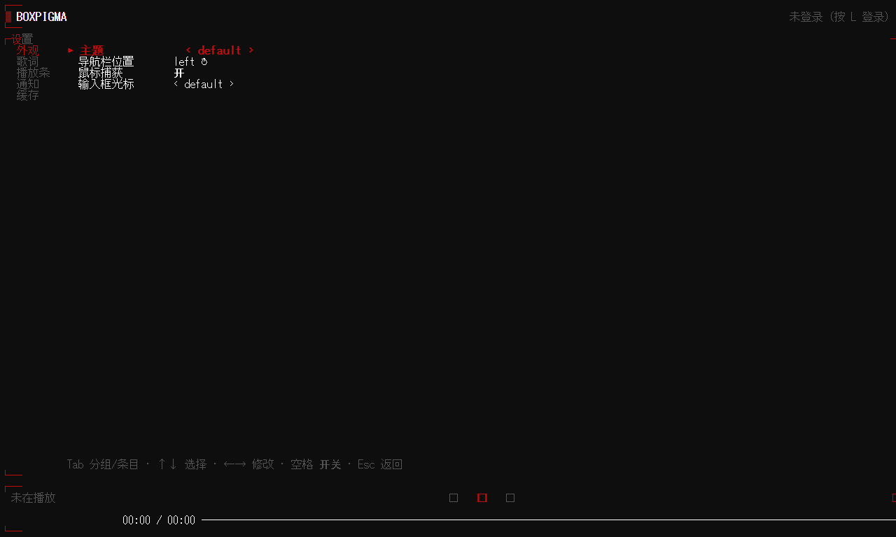
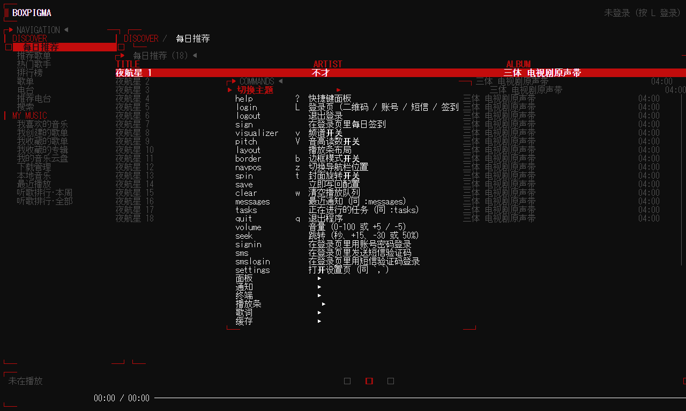

# boxpigma

[](https://github.com/GBLMX/pigma/actions/workflows/ci.yml)
[](https://github.com/GBLMX/pigma/actions/workflows/release.yml)
[](LICENSE)


boxpigma 把网易云音乐与本地音频播放带进终端：流式播放、逐字歌词、歌单与队列管理，全部围绕键盘组织，基于 [Ratatui](https://ratatui.rs)。

**1.0 是这个名字下的第一个版本**：从 `pigma` 改名而来，二进制、配置与缓存目录、IPC 套接字一并改名，旧数据会被自动接管；同时把一批自写实现换成了成熟方案。

<details>
<summary><b>📖 点击展开/折叠目录 (Table of Contents)</b></summary>

- [1.0 有什么](#10-有什么)
- [本仓库与原作者](#本仓库与原作者)
- [Features](#features)
- [Preview](#preview)
- [Install](#install)
  - [Linux / macOS](#linux--macos)
  - [Windows](#windows)
  - [AUR](#aur)
  - [从源码](#从源码)
- [Usage](#usage)
  - [快捷键](#快捷键)
  - [命令模式（vim 风格）](#命令模式vim-风格)
  - [CLI 控制（status / msg）](#cli-控制status--msg)
  - [无头守护进程模式（boxpigma -d）](#无头守护进程模式boxpigma--d)
- [Configuration](#configuration)
- [排障](#排障)
  - [日志](#日志)
  - [升级后配置/缓存"不见了"](#升级后配置缓存不见了)
  - [界面卡住（不再重绘）](#界面卡住不再重绘)
- [Development](#development)
- [Plan](#plan)
- [License](#license)

</details>

## 1.0 有什么

### 改名与数据迁移

| | |
| --- | --- |
| 二进制 | `boxpigma` |
| 配置 | `~/.config/boxpigma/`（原 `~/.config/pigma/`） |
| 缓存与队列 | `~/.cache/boxpigma/`（原 `~/.cache/pigma/`） |
| IPC | `boxpigma.sock` / Windows 命名管道 `\\.\pipe\boxpigma` |

首次运行会把旧的 `pigma` 目录**整体搬过来**（配置、cookie、队列、封面缓存都在里面），日志里留一行 `adopted … from before the rename`；搬不动（旧实例还在跑、权限不足）就继续用旧目录，**不会静默从空配置开始**。

### 自写实现换成成熟方案（每条都有实测依据）

| 方面 | 变化 | 依据 |
| --- | --- | --- |
| 日志 | `tracing` + `tracing-appender`：按天轮转、保留最近 7 个、行内带模块路径与本地时间 | 此前是单个无限增长的文件（实测已达 **2.9 MB**），且在调用线程持锁同步写；**135 个 `log::*!` 调用点一行未改**（`tracing-log` 桥接） |
| 对比度 | WCAG 亮度/对比度改用 `palette` | 全 **2²⁴ 个 8 位 sRGB 颜色**逐值对拍、19 个内置主题的 `on_accent` 结果全部一致；全仓颜色数学从三处收敛到一处 |
| 通知 | kitty 走其自有的 `OSC 99`（标题与正文分开、Base64 负载、`f=` 声明应用名） | 其余终端保持 `OSC 9` **逐字节不变** |
| 网络 | 搜索、封面、音频流补齐连接与读超时 | 此前**一处都没有**；音频流刻意**不加**总超时（会截断正在播放的下载），用 34 秒持续下载实证 |
| 页面结构 | 页面分发、页面按键与键位表合并为一张表 | 新增一个页面从改 **9 个文件降到 2 个** |
| 铺底与字形 | 铺底色改用 `Fill`；启动画面字形取自 FIGlet 字体 `Calvin S` | 字形是一次渲染后内嵌的常量，运行时不带字体依赖 |

### 新功能

- **随机主题**：`default_theme = "random"` 每次启动随机挑一个（`light_theme` 可单独设），`:theme random` 立刻重掷并把抽到的那一个写回配置
- **主题顺序稳定**：`:theme` 的循环顺序不再随进程变化（此前取自 `HashMap` 的随机顺序）
- **通知更完整**：kitty 上带标题与正文，并声明应用名便于过滤

### 性能

本仓库自带基准，`cargo test --release --lib -- --ignored --nocapture` 可复现：

| 基准 | 1.0 实测 |
| --- | --- |
| fft 512 / 1024 / 2048 点 | 4.95 / 10.13 / **21.76 µs** |
| hann 2048 点 | 13.52 µs |
| 分析帧（tap + 频谱 + 音高） | 129.57 µs → 30 fps 占单核 **0.389%** |
| playerbar 整帧（含频谱） | 79.15 µs → 30 fps 占单核 **0.237%** |
| 封面（解码 + 裁方 + 圆形蒙版 + 协议） | 488–583 µs / 首 |

内存占用（同一台机器实测，RSS，0.2 秒粒度采样 24 秒）：

| 场景 | 1.0 | 旧版 0.2.14 |
| --- | --- | --- |
| TUI 主界面 | **14.6 MB** | 14.0 MB |
| 守护进程（`boxpigma -d`） | **13.7 MB** | 13.4 MB |

四种情况的**启动峰值都等于 20 秒后的稳态**：启动不冒尖，之后平台平坦（24 秒窗口内没有增长趋势）。
RSS 大致是**二进制体积 + 约 3 MB**（1.0 的二进制 11.1 MB），换成 `tracing` 的增量在 +0.3~0.6 MB 之间。

1.1.0 复测（同机、同条件对照 `v1.0.0` 产品产物）：RSS **未上升**（TUI 13.0 / 守护 12.4 MB，对 13.4 / 12.2 MB；本轮未登录、无播放，绝对值低于上表）；二进制 **11,383,424 B**（对 11,119,096 B，**+258 KiB / +2.4%**）。基准本轮未取到可比数字（被测的 `dsp.rs` / `playerbar.rs` / `engine.rs` 相对 1.0.0 零改动，封面基准用的是本机缓存里的另一批真实图），故上表不改。

二进制体积：整条日志栈换新后 **11.1 MB**（换之前 10.8 MB）。完整变更记录见 [CHANGELOG](./CHANGELOG.md)；**每项框架调整的改前改后、依据与代价（含被否决的候选）见 [FRAMEWORK.md](./FRAMEWORK.md)**。

## 本仓库与原作者

| | |
| --- | --- |
| **上游** | [akirco/pigma](https://github.com/akirco/pigma) —— 作者 akirco，Apache-2.0。原始版权与许可声明见 [LICENSE](./LICENSE)，**未作改动** |
| **本仓库** | GBLMX 的 fork，由 GBLMX 维护。这里的提交、[releases](https://github.com/GBLMX/pigma/releases) 与 AUR 包 `boxpigma-gblmx-bin` 都由本仓库负责，与原作者无关；上游是否采纳这些改动、上游自身的维护计划，本仓库不代表也不承诺 |
| **向上游贡献** | 上游的 [CONTRIBUTING](./CONTRIBUTING.md) 仍然适用。本仓库的 `main` 已与上游分叉，向上游提 PR 请从独立分支（如 `feat/...`）出发，不要从 `main` |

相对上游 `21c380d`（v0.2.14），本仓库自带的改动分两类 —— 这个划分决定了同步方式（见 CONTRIBUTING 的「与上游同步」一节）。

**一、结构性差异**（上游不会覆盖；每次同步必然冲突，冲突时保留本仓库版本）

- **项目身份**：包名与二进制名 `boxpigma`（上游为 `pigma`），配置目录 `~/.config/boxpigma`、缓存目录 `~/.cache/boxpigma`、IPC socket `boxpigma.sock` 与 Windows 命名管道一并改名；首次运行会把旧的 `pigma` 目录整体接管过来（搬不动就继续用旧目录），不丢配置与缓存
- **构建**：两个 crate 收进一个 Cargo workspace —— 依赖版本统一（rustls 三份规格合一）、`cargo test/clippy --workspace` 覆盖全部成员，CI 增加 ubuntu 与成员检查
- **日志栈**：`tracing` + `tracing-appender`（按天轮转、保留最近 7 个、行内带模块路径与本地时间）；135 处 `log::*!` 由 `tracing-log` 桥接，调用点无需改动
- **UI 内部结构**：页面分发、页面按键与键位表合并为一张表（新增一个页面从改 9 个文件降到 2 个）；铺底色改用 `Fill`
- **主题内部**：WCAG 亮度与对比度改用 `palette`，全仓只剩一处颜色数学；`default_theme = "random"` 每次启动随机挑一个、`:theme random` 立刻重掷；主题名排序固定，`:theme` 循环顺序不再随进程变化
- **启动画面**：字形取自 FIGlet 字体 `Calvin S`，一次渲染后作为常量内嵌（运行时不带字体依赖）
- **配置**：`config_version` 版本号，旧文件加载时自动升级并把原文件备份为 `config.toml.bak-v0`

**二、增量差异**（可被上游采纳或替代；挑上游提交时优先看这一类）

- **修复**：下载缓存条目只在流完成后记录 · 默认日志级别改为 INFO · 清空的 `sections`/`columns` 序列化不再 panic · eapi 非 2xx 只告警 · IPC socket 权限收窄到属主 · `.gitignore` 忽略调试残留 · 搜索、封面、音频流补齐连接与读超时（音频流刻意**不加**总超时，否则会截断正在播放的下载）
- **播放**：解析失败按类型分类（网络失败重试一次、无版权/无地址直接走兜底源），不再靠错误字符串前缀判断
- **外观**：符号预设（`nerd`／`unicode`／`ascii`，不装 Nerd Font 也能用）· 按终端能力降级真彩色 · 依据终端背景自动选明/暗主题 · **背景也由主题绘制**（此前只给文字上色，浅色主题在深色终端上会变成零星灰字）· 内置 20 套主题 + `[themes.<名>]` 继承式自定义 · 高亮行的前景色按对比度自动选取，浅色主题下也读得出来
- **新增**：频谱可视化 · 音高读数（自实现 YIN，无新增依赖）· 鼠标交互（点击 seek／切区／播放控制／模式／喜欢／静音）· vim 风格 `:` 命令行与 Tab 补全（密码/短信登录、退出登录、签到）· 听歌打卡（播满约 30 秒即上报，与官方客户端口径一致；短于 30 秒的歌以播完为准）· **歌词四种显示样式**（`:lyrics window|one_line|flow|plain`）· 歌词严格按解码位置对轴 · 终端开关：`mouse`／`cursor_style`／`[notify]` 桌面通知 · 随仓库提供的性能基准
- **终端协议**：kitty 图形协议封面（可用 `[playerbar] image_protocol` 强制）· 同步刷新（整帧一次性呈现，也是 kitty 放图的规范要求）· kitty 键盘协议（`Esc` 不再被读成 `Alt+<key>`）· 括号粘贴 · 封面协议以**终端的回答**为准，tmux 内自动回退 · kitty 的桌面通知用其自有的 `OSC 99`（标题与正文分开、Base64 负载、`f=` 声明应用名），其余终端保持 `OSC 9` 逐字节不变
- **打包**：AUR `boxpigma-gblmx-bin`（独立包名，发布时带真实校验和）

**注意：**

> 该项目仅供学习与研究使用。

**升级提示：`config.toml` 现在带 `config_version`，旧文件（没有该字段，按 v0 处理）在加载时会自动升级，并把原文件备份为 `config.toml.bak-v0`；反之，来自更新版本的配置文件按原样使用（未识别的字段忽略，不会被降级覆盖）。**

**[配置参考](./config.example.toml)**

**终端必须配置并使用支持 Nerd Fonts（如 JetBrainsMono Nerd Font, FiraCode Nerd Font 等）的字体，否则 `\uE0B2`等字符无法正确显示，会变成乱码或方块。**

## Features

**播放**

- [x] 流式播放、边听边存、低延迟 seek、本地音频播放
- [x] 下载管理（与边听边存重合）· 云盘上传（缓存文件、本地文件）· 音量控制
- [x] 多源 fallback：kugou / kuwo / bilibili / youtube（无需 cookie），思路参考 [UnblockNeteaseMusic](https://github.com/UnblockNeteaseMusic/server)
- [x] 播放模式、心动模式、歌曲操作（like / dislike / fav …）

**界面**

- [x] 自定义渲染的导航列表与内容列表、表头自定义、数据分页加载
- [x] 歌词四种显示样式（窗口 / 一次一行 / 颜色流动 / 纯列表）+ 渐变逐字高亮 + 严格按解码位置对轴
- [x] 重写 playerbar（含封面）· 主题背景完整绘制 · 高亮行对比度自动保证
- [x] 频谱可视化（`v`）· 音高读数（`V`，自实现 YIN，无新增依赖）
- [x] vim 风格 `:` 命令行与 Tab 补全 · command panel（`ctrl+p`）· 鼠标交互与光标形状
- [x] 重写 splash

**终端**

- [x] kitty 图形协议封面（可用 `[playerbar] image_protocol` 强制）· 协议以**终端的回答**为准，tmux 内自动回退
- [x] 同步刷新（整帧一次性呈现）· kitty 键盘协议 · 括号粘贴
- [x] 桌面通知（切歌 / 出错；kitty 走 `OSC 99`，其余终端 `OSC 9`）

**集成与打包**

- [x] 命令行控制（`status` / `msg`）+ JSON IPC（waybar 等）· 守护进程模式（`boxpigma -d`）
- [x] 系统包管理器安装（yay / paru / scoop）· shell 补全（bash / zsh / fish / elvish / powershell）

**开发**

- [x] 单一 Cargo workspace（`cargo test/clippy --workspace` 覆盖全部成员）
- [x] 随仓库提供的性能基准（`cargo test --release --lib -- --ignored --nocapture`）

**待办**

- [x] command panel 重写，更多运行时配置支持（`ctrl+p` 面板 + `:mouse` / `:cursor` / `:notify` / `:lyricgradient` / `:saveonplay` 等可运行时修改的设置）
- [x] 云盘源作为 fallback（NCM → sonar → **云盘** → 才报错）
- [x] 本地音频歌词、元数据重写（`lofty` 读标签；同名侧车 `.lrc` 复用既有歌词管线）
- [x] 歌手信息（歌手详情页：简介 / 热门曲目 / 专辑）
- [ ] landing page

## Preview


<table>
  <tr>
    <td></td>
    <td></td>
  </tr>
  <tr>
    <td></td>
    <td></td>
  </tr>
</table>


## Install

> 本节命令都对应本仓库的 [releases](https://github.com/GBLMX/pigma/releases)；通过上游渠道装到的是不含本仓库改动的版本。

### Linux / macOS

```sh
# https://github.com/marcosnils/bin
bin install https://github.com/GBLMX/pigma
```

或从 [releases](https://github.com/GBLMX/pigma/releases) 下载 `boxpigma-<target>.tar.gz`（`x86_64` / `aarch64`，macOS 为 `apple-darwin`），解包后把 `boxpigma` 放进 `$PATH`。

> `gnu` 构建依赖系统音频库（如 `alsa-lib`）。

### Windows

从 [releases](https://github.com/GBLMX/pigma/releases) 下载 `boxpigma-x86_64-pc-windows-msvc.zip`（或 `aarch64` 版），解包后把 `boxpigma.exe` 放进 `%PATH%`。

### AUR

```sh
yay -S boxpigma-gblmx-bin      # 或 paru -S boxpigma-gblmx-bin
```


> ⚠️ **首次发布前需要两步**（之后每次 release 工作流都会自动更新它）：
> 1. 把本机 AUR 公钥（`~/.ssh/aur.pub`）的内容贴进 AUR 的 **My Account → SSH Public Key**；
> 2. 把**对应的私钥**写进本仓库的 `AUR_SSH_PRIVATE_KEY` secret。
>
> AUR **允许用推送创建新包** —— 克隆一个还不存在的 pkgbase 会得到 `warning: You appear to have cloned an empty repository`，这是预期行为（见 [AUR submission guidelines](https://wiki.archlinux.org/title/AUR_submission_guidelines#Creating_package_repositories)）。

### 从源码

```sh
cargo install --git https://github.com/GBLMX/pigma.git
```

或本地构建 —— `crates/sonar` 依赖 `crates/y7dl` 子模块，克隆时要一并取回：

```sh
git clone --recurse-submodules https://github.com/GBLMX/pigma.git
cd pigma                     # 仓库名仍是 pigma，二进制叫 boxpigma
cargo build --release
# binary at target/release/boxpigma
```

## Usage

### 快捷键

| 快捷键        |                     描述                     |
| :------------ | :------------------------------------------: |
| w             |                 清空播放队列                 |
| s/d           |       添加到喜欢/不感兴趣(仅每日推荐)        |
| ?             |                  快捷键面板                  |
| r             |               手动刷新列表内容               |
| tab/shift+tab |              切换导航/搜索引擎               |
| enter         |                播放/进入列表                 |
| space         |                     暂停                     |
| f             |                   播放队列                   |
| l             |                     歌词                     |
| /             |                  搜索/过滤                   |
| b             |                   样式切换                   |
| left /right   |                   seek 15s                   |
| p /n          |                上一首/下一首                 |
| ctrl+p        |                command panel                 |
| L             |               登录网易云                     |
| c             |  切换表格为cell/row模式(回车进入歌手/专辑)   |
| m             | 切换播放模式（适用于我的歌单或我喜欢的音乐） |
| u             |  上传`本地音乐`或`下载管理`的音频到音乐云盘  |
| g/G           |                列表顶部/底部                 |
| v             |        频谱显示开关（同 `:visualizer on`）     |
| V             |          音高读数开关（同 `:pitch on`）        |
| :             |      命令模式（vim 风格，Tab 补全，见下节）     |

### 命令模式（vim 风格）

按 `:` 打开命令行：`Enter` 执行、`Esc` 取消、`Tab` 补全（命令名、`:theme` 的主题名、`on`/`off`）。
结果与错误都以 toast 回报，跟 vim 一样（例如 `E: 未知命令: foo`）。

| 命令 | 说明 |
|---|---|
| `:q` / `:quit` | 退出 |
| `:help` / `:login` | 快捷键面板 / 登录页 |
| `:save` | 立即写回 `config.toml` |
| `:theme <名字>` | 切换主题（`Tab` 会列出全部主题名） |
| `:volume 75` / `:volume +5` / `:volume -10` | 音量（与 `boxpigma msg volume` 同一套语法） |
| `:seek 90` / `:seek +15` / `:seek -30` / `:seek 50%` | 跳到某秒 / 相对跳转 / 百分比 |
| `:visualizer on\|off` | 频谱显示开关（同 `v` 键） |
| `:signin <账号> <密码>` | 邮箱或手机号 + 密码登录（`:login` 仍是二维码页） |
| `:sms <手机号>` | 发送短信验证码 |
| `:smslogin <手机号> <验证码>` | 短信验证码登录 |
| `:logout` | 退出登录（清服务端会话与本地 cookie） |
| `:sign` | 网易云每日签到（云贝） |
| `:layout default\|modern\|minimal` | 播放条布局（`modern` 下频谱只有封面列的 8 格宽，另两种布局是整行） |
| `:pitch on\|off` | 音高读数开关（同 `V` 键） |
| `:lyrics window\|one_line\|flow\|plain` | 歌词显示样式（`Tab` 会列出四种与各自说明） |
| `:notify song_change\|errors on\|off` | 切歌提示 / 播放错误提示开关 |
| `:mouse on\|off` | 鼠标捕获开关（影响滚轮与双击；当场写终端转义序列） |
| `:cursor default\|block\|underline\|bar` | 终端光标形状（当场生效） |
| `:lyricgradient <预设>` | 歌词扫光渐变（`Tab` 列出全部预设） |
| `:saveonplay on\|off` | 播放时自动写入「我喜欢的音乐」 |

终端背景为浅色时，`:theme` 配合配置里的 `background = "auto"` 与 `light_theme` 会自动选浅色主题。

### CLI 控制（status / msg）

查询/控制一个**正在运行**的 boxpigma 实例（交互界面或守护进程均可），
通过 `~/.cache/boxpigma/boxpigma.sock` 上的 Unix socket 通信：

```bash
# 生成 shell 补全脚本（bash / zsh / fish / elvish / powershell）
# bash
boxpigma completions bash > ~/.local/share/bash-completion/completions/boxpigma

# zsh
boxpigma completions zsh > "${fpath[1]}/_pigma"

# fish
boxpigma completions fish > ~/.config/fish/completions/boxpigma.fish

# powershell：生成脚本并在 $PROFILE 中自动加载（在 pwsh 里执行）
boxpigma completions powershell | Out-File "$HOME/.config/powershell/boxpigma.ps1" -Encoding utf8
Add-Content $PROFILE '. "$HOME/.config/powershell/boxpigma.ps1"'

```

| 命令 | 说明 |
|---|---|
| `boxpigma status` | 查询状态（默认 plain 文本） |
| `boxpigma status --json` | 以 JSON 输出 |
| `boxpigma status -L` | 列出当前播放队列（`>` 标记当前曲目），`-L --json` 输出原始 `QueueSnapshot` |
| `boxpigma status --template "{name}  {artist}  {current}/{duration}  {status}  vol {volume}%"` | 自定义 plain 输出模板 |
| `boxpigma msg list` | 列出当前播放队列（`▶` 标记当前曲目），`--json` 输出原始 `QueueSnapshot` |
| `boxpigma msg next` / `boxpigma msg previous` | 下一首 / 上一首 |
| `boxpigma msg pause` / `boxpigma msg play` | 暂停 / 播放（`boxpigma msg play <song-id>` 按 id 跳播队列中的歌曲） |
| `boxpigma msg search <keyword>` | 搜索并返回歌曲数据（解析顺序：NCM 失败重试一次 → sonar → 云盘兜底，标出 `source` 和 `id`），再 `boxpigma msg play <id>` 播放选中的那首 |
| `boxpigma msg toggle_play` | 播放/暂停切换 |
| `boxpigma msg mode` | 切换播放模式 |
| `boxpigma msg like` / `boxpigma msg dislike` | 喜欢 / 不喜欢 |
| `boxpigma msg toggle_like` | 喜欢/取消喜欢（切换当前曲目） |
| `boxpigma msg switch-list <endpoint>` | 动态切换守护进程的队列到指定端点（如 `recommend_songs`、`toplist`），歌单端点可用 `--playlist N` 选第 N 个 |
| `boxpigma msg volume 75` | 绝对音量（0-100） |
| `boxpigma msg volume +5` / `-10` | 相对 ±%（与 TUI 的 `+` / `-` 一致，支持负数） |

`boxpigma status` 的 `--template` 支持占位符：`{name}` `{artist}` `{album}` `{current}`/`{position}`
`{duration}` `{volume}` `{status}` `{mode}` `{id}` `{liked}`。
未指定时默认模板来自配置项 `cli_status_template`；`--json` 优先于配置项
`cli_status_format`（见 [config.example.toml](./config.example.toml)）。

#### 直接走 Unix socket（socat / 脚本）


> **仅 Linux/macOS**：`status` / `msg` 子命令底层就是往 `~/.cache/boxpigma/boxpigma.sock`
> 发一行 JSON。Windows 用的是命名管道，见下节。
> 不想用 `boxpigma` 二进制时，可用 `socat` 或任何 Unix socket 客户端直接控制：

```bash
# 查询状态（返回一行 JSON）
printf '{"cmd":"status"}\n' | socat - "$HOME/.cache/boxpigma/boxpigma.sock"

# 列出播放队列
printf '{"cmd":"list"}\n' | socat - "$HOME/.cache/boxpigma/boxpigma.sock"

# 播放控制（注意 action 是嵌套对象，与 boxpigma msg 实际发送的 JSON 一致）
printf '{"cmd":"msg","action":{"action":"next"}}\n'          | socat - "$HOME/.cache/boxpigma/boxpigma.sock"
printf '{"cmd":"msg","action":{"action":"previous"}}\n'      | socat - "$HOME/.cache/boxpigma/boxpigma.sock"
printf '{"cmd":"msg","action":{"action":"pause"}}\n'         | socat - "$HOME/.cache/boxpigma/boxpigma.sock"
printf '{"cmd":"msg","action":{"action":"play"}}\n'          | socat - "$HOME/.cache/boxpigma/boxpigma.sock"
printf '{"cmd":"msg","action":{"action":"mode"}}\n'          | socat - "$HOME/.cache/boxpigma/boxpigma.sock"
printf '{"cmd":"msg","action":{"action":"like"}}\n'          | socat - "$HOME/.cache/boxpigma/boxpigma.sock"
printf '{"cmd":"msg","action":{"action":"dislike"}}\n'       | socat - "$HOME/.cache/boxpigma/boxpigma.sock"
printf '{"cmd":"msg","action":{"action":"toggle_like"}}\n'   | socat - "$HOME/.cache/boxpigma/boxpigma.sock"

# 音量：绝对（0.0-1.0）或相对增量
printf '{"cmd":"msg","action":{"action":"volume","absolute":0.75}}\n' | socat - "$HOME/.cache/boxpigma/boxpigma.sock"
printf '{"cmd":"msg","action":{"action":"volume","delta":0.05}}\n'    | socat - "$HOME/.cache/boxpigma/boxpigma.sock"

# 切换队列到指定端点（歌单端点可用 "playlist" 选第 N 个，1 起始）
printf '{"cmd":"msg","action":{"action":"switch_list","endpoint":"toplist","playlist":2}}\n' | socat - "$HOME/.cache/boxpigma/boxpigma.sock"
```

约定：每行请求须以换行结尾，服务端每连接处理一个请求并回一行 JSON
（`msg` 成功回 `{"ok":true}`）。socket 路径可用 `--socket <path>` 自定义。

#### Windows：命名管道控制（PowerShell）

Windows 上 IPC 走命名管道 `\\.\pipe\boxpigma`（可用 `--socket <pipe-name>` 自定义），
协议相同（一行 JSON + 换行，服务端回一行 JSON）。用 PowerShell 控制：

```powershell
function Send-boxpigma($json) {
    $pipe = New-Object System.IO.Pipes.NamedPipeClientStream('.', 'boxpigma', [System.IO.Pipes.PipeDirection]::InOut)
    $pipe.Connect(5000)
    $sw = New-Object System.IO.StreamWriter($pipe)
    $sw.NewLine = "`n"
    $sw.WriteLine($json); $sw.Flush()
    $sr = New-Object System.IO.StreamReader($pipe)
    return $sr.ReadLine()
}

Send-boxpigma '{"cmd":"status"}'                 # 查询状态
Send-boxpigma '{"cmd":"list"}'                   # 列出播放队列
Send-boxpigma '{"cmd":"msg","action":{"action":"next"}}'    # 下一首
Send-boxpigma '{"cmd":"msg","action":{"action":"volume","absolute":0.75}}'  # 音量 75%
```

### 无头守护进程模式（boxpigma -d）

以无终端方式后台运行（可挂在 waybar / systemd 下），加载指定的 API 作为初始队列（**不自动播放**，用 `boxpigma msg play` 或 waybar 的 toggle 按钮开始）。

| 选项 | 说明 |
|---|---|
| `boxpigma -d` | 等价于 `boxpigma -d liked` |
| `boxpigma -d toplist` | 加载指定端点 |
| `boxpigma --daemon user_cloud_disk` | `-d` 的全写形式 |
| `boxpigma -d toplist:3` | 歌单/榜单端点用 `:N` 选第 N 个（1 起始） |

支持的内置 API 与导航项一致：

| 端点 | 类型 | 说明 |
|---|---|---|
| `liked` | 歌曲（默认） | 我喜欢的音乐，需登录 |
| `recommend_songs` | 歌曲 | 每日推荐歌曲 |
| `user_cloud_disk` | 歌曲 | 我的云盘 |
| `download` | 歌曲 | 本地下载 |
| `local_music` | 歌曲 | 本地音乐 |
| `recent` | 歌曲 | 最近播放 |
| `recommend_resource` | 歌单 | 每日推荐歌单 |
| `toplist` | 歌单 | 排行榜 |
| `top_song_list` | 歌单 | 热门歌单 |
| `user_radio_sublist` | 歌单 | 我的电台 |
| `user_song_list` | 歌单 | 用户歌单 |
| `user_created_song_list` | 歌单 | 创建的歌单 |
| `user_subscribed_song_list` | 歌单 | 订阅的歌单 |
| `album_sublist` | 歌单 | 收藏的专辑 |
| `search` | 其他 | 搜索热榜（无可播队列） |
| `top_singers` | 其他 | 热门歌手（无可播队列） |

歌单类端点解析出来是一组歌单，默认加载第一个；`-d` 可用 `ENDPOINT:N`（如 `boxpigma -d toplist:3`）选择第 N 个（1 起始），`msg switch-list` 可用 `--playlist N`。序号与 TUI 中列表显示的顺序一致，可先在 TUI 里查看：

启动后即用 `boxpigma status` / `boxpigma msg` 控制；`SIGINT`/`SIGTERM` 会保存会话并干净退出。

**Waybar 集成**：

  - 参考[waybar](./waybar)。状态模块用 bash 脚本 `waybar/boxpigma`，每秒调 `boxpigma status --json` 获取状态并格式化为 waybar JSON。脚本内置 `ensure_daemon`，首次调用时自动启动 daemon。

```jsonc
// ~/.config/waybar/config.jsonc 核心片段
"custom/boxpigma": {
  "exec": "~/.config/waybar/scripts/boxpigma",
  "interval": 1,
  "return-type": "json",
  "on-click-right": "boxpigma msg mode",
  "on-scroll-up": "boxpigma msg volume +5",
  "on-scroll-down": "boxpigma msg volume -5"
}
```

## Configuration

配置文件在 `~/.config/boxpigma/config.toml`。**带注释的权威参考是随仓库发布的 [`config.example.toml`](./config.example.toml)**，本节只列最常用的几项。

| 项 | 作用 |
| --- | --- |
| `config_version` | 配置版本；旧文件加载时自动升级，并把原文件备份为 `config.toml.bak-v0` |
| `default_theme` / `light_theme` | 暗色/浅色槽位的主题名；可写 `"random"` 每次启动随机挑一个 |
| `background` | `auto`（跟随终端背景）/ 强制 `dark` 或 `light` |
| `[logger] log_level` | `error` / `warn` / `info` / `debug` / `trace` |
| `[themes.<名字>]` | 继承式自定义主题：写 `base` + 要覆盖的颜色 |
| `[[sections]]` / `[[columns]]` | 导航区与内容列表的字段、宽度与覆盖规则 |
| `[playerbar]` | 布局（`default` / `modern` / `minimal`）、进度条样式与渐变、封面与 `image_protocol` |
| `[lyrics]` | 歌词显示样式与渐变 |
| `[terminal]` | 鼠标捕获与光标形状 |
| `[notify]` | 桌面通知开关（切歌 / 出错） |
| `[cache]` | 内容缓存与 save-on-play |

改完可用 `:save` 立即写回；`:` 命令行里 `:theme <Tab>`、`:layout <Tab>` 都能补全可用取值。

## 排障

### 日志

按天一个文件、保留最近 7 个；开发构建写在工作目录，安装后写在配置目录：

```sh
tail -f ~/.config/boxpigma/debug.log.$(date -u +%Y-%m-%d)
```

行内带模块路径与本地时间：

```
2026-09-21T02:05:15+08:00  INFO boxpigma::ipc: ipc: listening on /home/user/.cache/boxpigma/boxpigma.sock
```

### 升级后配置/缓存"不见了"

不会。首次运行会把旧的 `pigma` 目录整体搬到 `boxpigma` 名下；若日志出现 `could not move …; staying on the old directory`，说明当时搬不动（旧实例在跑或权限不足），程序会**继续使用旧目录** —— 关掉旧实例后再启动一次即可完成搬迁。

### 界面卡住（不再重绘）

从外部抓线程栈即可，不必给程序加代码：

```sh
eu-stack -p <pid>                              # elfutils
gdb -p <pid> -batch -ex 'thread apply all bt'
cat /proc/<pid>/task/*/wchan                   # 内核视角
```

## Development

```sh
git clone --recurse-submodules https://github.com/GBLMX/pigma.git
cd pigma
cargo run                                             # 交互界面
cargo test --workspace --all-features
cargo clippy --workspace --all-targets
cargo test --release --lib -- --ignored --nocapture   # 性能基准
cargo +nightly fmt
```

贡献流程见 [CONTRIBUTING](./CONTRIBUTING.md)：其中「与上游同步」一节说明本仓库如何按提交 cherry-pick 同步上游，以及哪些文件属于本仓库的结构性差异。

## Plan

- 完善 waybar/systemd 集成文档与示例配置
- 守护进程模式下更多端点的支持（榜单/歌单自动展开）
- `boxpigma msg` 更多动作（seek、queue 操作等）

## License

Licensed under the [Apache-2.0](LICENSE) license.
